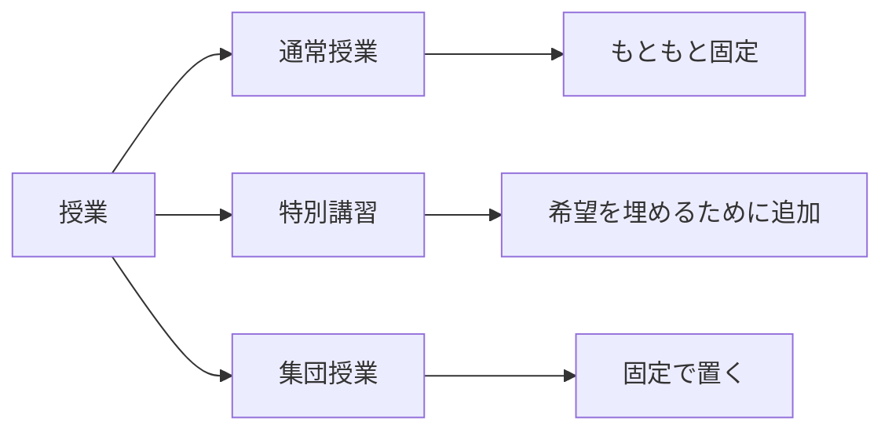
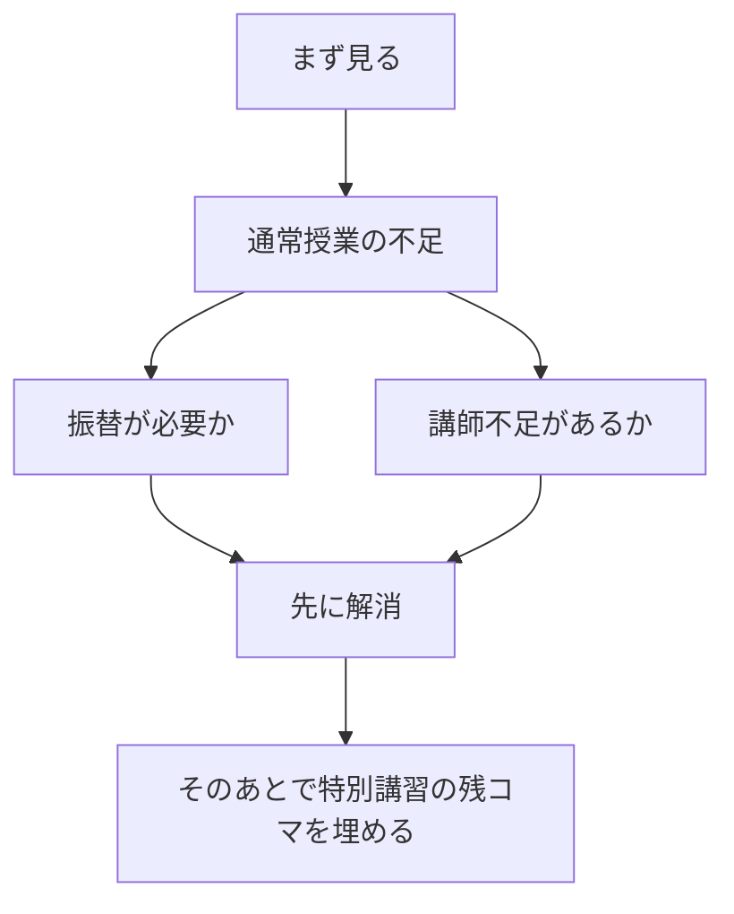
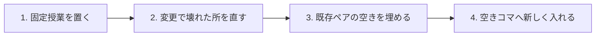
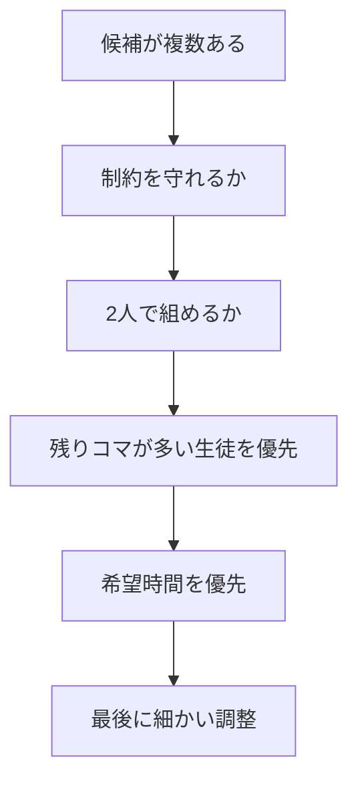
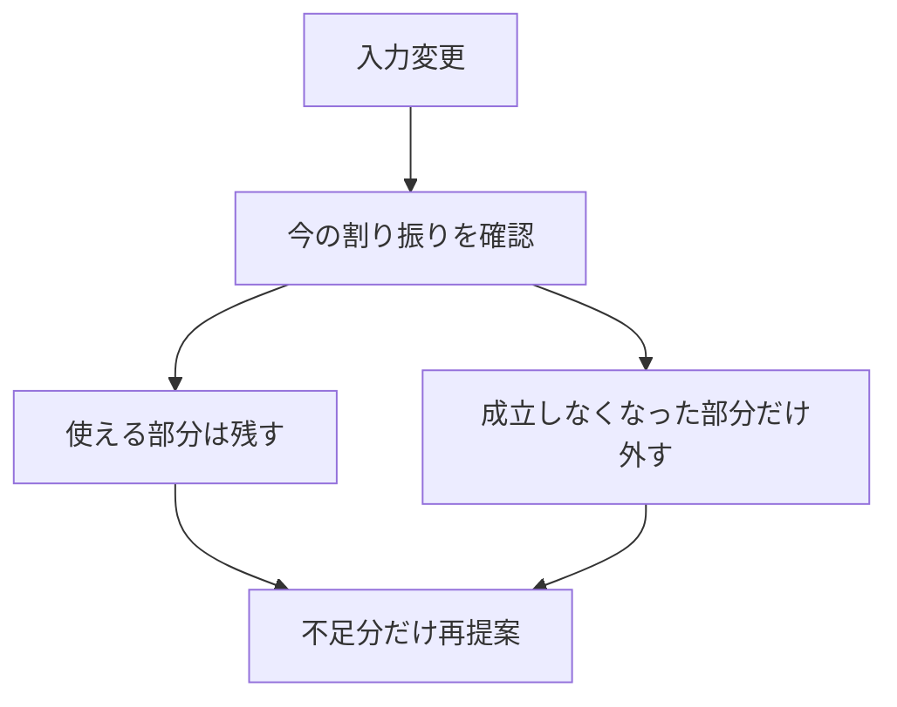
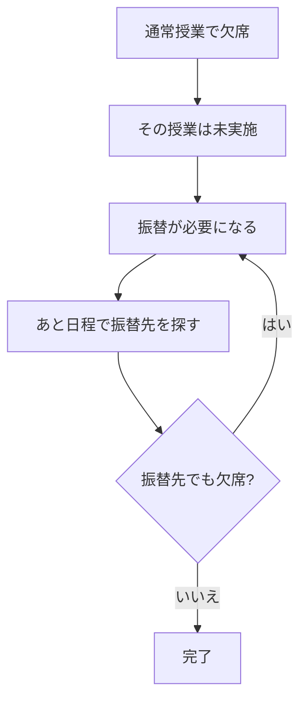

# LessonScheduleTable
## コマ割りの考え方

誰にでも説明しやすい版

- 通常授業を守る
- 希望コマをできるだけ満たす
- 変更や欠席が出ても直しやすくする

---

# 1. このアプリは何をしているか

このアプリは、講習のコマ割りを作るだけではありません。

次の3つを同時にうまく回すための仕組みです。

- もともとの通常授業をきちんと扱う
- 特別講習の希望コマ数をできるだけ満たす
- 後から変更や欠席が出ても、崩れにくくする

一言でいうと、

**「最初に組む」ための道具ではなく、最後まで運用するための道具**

---

# 2. 扱う授業は3種類

- 通常授業: もともと曜日と時限が決まっている授業
- 特別講習: 希望コマ数を満たすために自動で入れる授業
- 集団授業: 固定で置く授業

ポイント:

**この3つを同じものとして扱わないから、欠席や振替の管理がぶれません。**

---

# 3. 何をいちばん大事にしているか

このシステムの優先順位はシンプルです。

- 通常授業で足りていないものを先に解消する
- そのあとで、特別講習の希望コマを埋める

つまり、

**通常授業の問題を放置したまま、特別講習だけきれいに埋めることはしない**

---

# 4. 自動で入れられる条件

自動でコマに入れられるのは、次の条件を満たすときです。

- 先生がその時間に入れる
- 生徒がその時間に出られる
- 組み合わせに問題がない
- 先生がその科目を教えられる
- まだ必要なコマ数が残っている

補足:

- 未提出の生徒は、特別講習では「まだ入れない」扱い
- ただし通常授業の必要数は、それだけで消えない
- 途中入塾の生徒は、先に通常授業だけ登録しておき、特別講習は希望入力後に他の生徒と同じ条件で自動割振りする

ここが、通常授業と特別講習を分けて考える理由です。

---

# 5. 自動コマ割りの流れ

この流れの大事な点は、

**毎回ゼロから全部作り直していない** ことです。

まず今ある割り振りを見て、

- 使えるものは残す
- 壊れた部分だけ直す
- 足りない分だけ追加する

という動き方をします。

---

# 6. なぜその組み合わせになるのか

候補がいくつもあるときは、次の考え方で選びます。

- まず制約を守る
- できれば2人ペアにする
- 残りコマが多い生徒を先に埋める
- 希望時間を優先する
- 最後に先生の負担の偏りなどを少し整える

つまり、

**見た目のきれいさより、必要な授業を安全に埋めることが先です。**

---

# 7. 入力変更があったとき

講習では、後から条件が変わるのが普通です。

- 生徒の希望コマ数が変わる
- 生徒の不可日や不可コマが増える
- 先生の出勤希望が変わる
- 途中入塾で通常授業を追加したあと、後から講習希望が入る

このときの考え方は次の通りです。

つまり、

**全部やり直しではなく、必要な所だけ直す** 仕組みです。

途中入塾については、

- 通常授業は登録した時点で先に反映する
- 特別講習は希望入力が入ってから自動割振りの対象に入れる

という運用を前提にしています。

---

# 8. 欠席が出たとき

このアプリで特に大事なのが、欠席の扱いです。

- 通常授業で欠席すると、その授業は終わったことにならない
- だから「振替が必要な授業」として残る
- もし振替先でも欠席したら、また未実施として残る

つまり、

**実際に消化できるまで追いかける** 仕様です。

---

# 9. 未完了が出る理由

未完了は、単に「残りがある」という意味ではありません。

主な理由は次の2つです。

- 通常授業側で先生が足りない
- 生徒と先生の空きが合わない

見方としては、

- 残コマ詳細
- 先生不足

に分けて確認します。

だから、未完了表示は「まだ終わっていない」だけでなく、

**どこが原因で止まっているかを知るための表示** です。

---

# 10. このシステムを一言で言うと

このアプリは、

**「自動で一発できれいに割る道具」ではなく、\
「通常授業を守りながら、変更や欠席に耐えて、最後まで運用するための道具」**

です。

そのために、

- 通常授業を最優先で守る
- 変更が出ても差分で直す
- 欠席しても未実施分を追いかける
- 未完了の理由を分かるようにする

という設計になっています。

## 伝えたい結論

**現場で本当に困る「後から崩れる」を防ぐためのコマ割りシステムです。**

---

# 11. 制約カードの注意表示

コマ割り画面では、制約カードの違反が **注意バッジ** で表示されます。

## 表示される制約（ハード制約）

配置自体をブロックする強い制約です。手動で割り当てた場合に「注意」バッジが出ます。

- **1コマ上限 / 2コマ上限 / 3コマ上限**: 既に上限数配置済み
- **2コマ連続 / 2コマ連続(一コマ空け)**: 既に2コマ配置済み、または連続ルールに違反
- **集団後2コマ連続**: 既に2コマ配置済み
- **通常授業連結**: 既に特別講習コマ配置済み

## 表示されない制約（ソフト制約）

自動提案のスコアに影響し優先度を下げますが、配置自体はブロックしない制約です。
注意バッジは表示されません。

- **1限回避**: 1限への配置スコアを下げる（ペア形成を抑制）
- **受験生以外の後半コマ優先**: 前半コマのスコアを下げる
- **通常講師優先**: 通常講師以外のスコアを下げる

---

# 12. フィルター機能

コマ割りグリッドの右上に **絞り込みフィルター** があります。

- 講師名または生徒名を入力すると、その人が含まれるペアだけがハイライト表示
- マッチしないペアは薄く表示（操作は引き続き可能）
- マッチするペアが1つもないコマ全体も薄く表示
- ×ボタンでフィルターをクリア

使い方:
- 特定の講師の担当状況を一覧で確認したいとき
- 特定の生徒がどのコマに入っているか探したいとき
